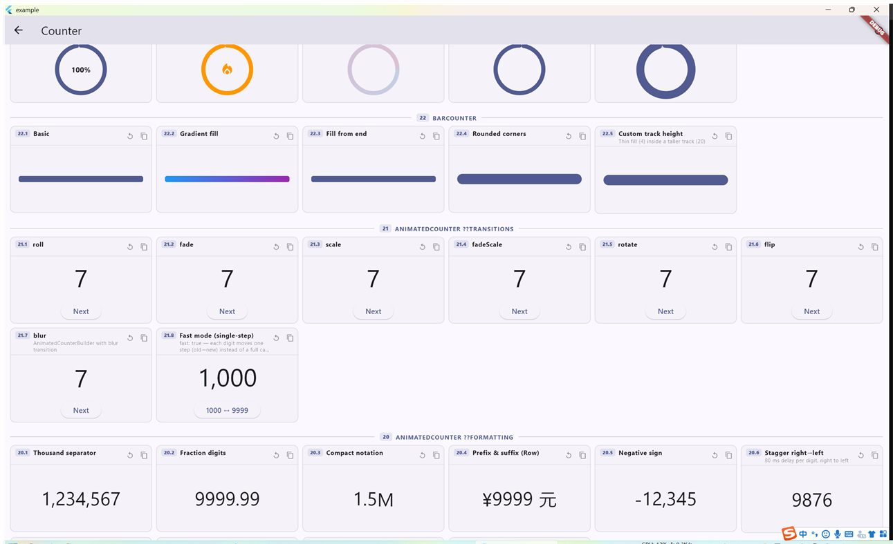
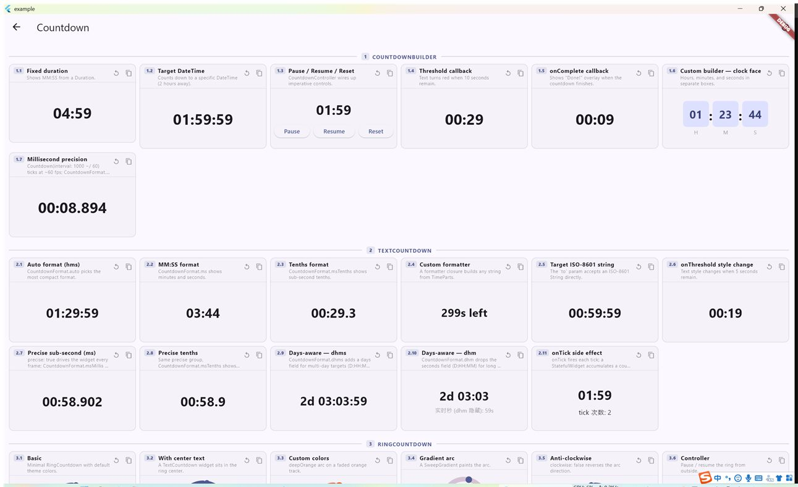
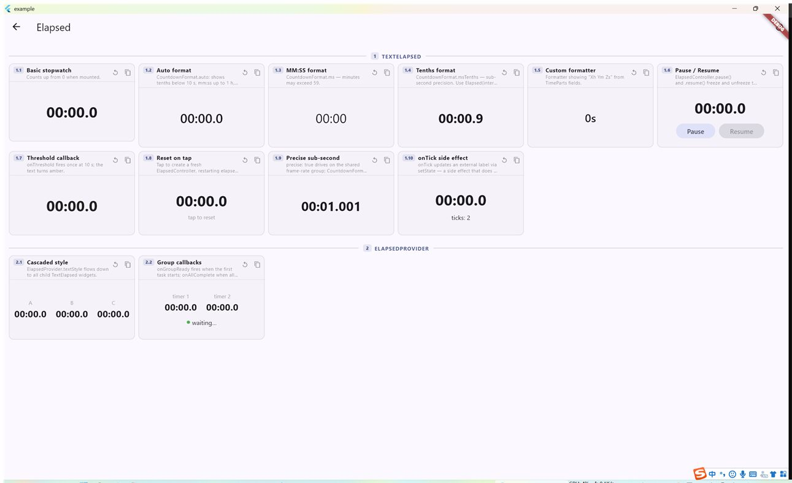

# countman

**High-performance counter, countdown & elapsed animations for Flutter — driven by ONE shared vsync ticker, not per-widget timers. Built for high-concurrency timing.**

**English** · [简体中文](README.zh.md)

[](https://pub.dev/packages/countman)
[](LICENSE)
[](https://icodejoo.github.io/dart-labs/)

**[▶ Live Demo](https://icodejoo.github.io/dart-labs/)** — Counter · Countdown · Elapsed, all widgets, all APIs.

- ⚡ **No `Timer.periodic`, no per-widget `AnimationController`** — a single `SchedulerBinding.scheduleFrameCallback` drives everything.
- 🚀 **Built for high concurrency** — the 100th live counter/timer costs the same as the 1st; the ticker auto-idles when nothing is animating.
- 🎨 Counter · Countdown · Elapsed, each with text / ring / bar / odometer / dial / flip-card renderers, per-widget styles, controllers and providers.

---

## Screenshots

| Counter | Countdown | Elapsed |
| :---: | :---: | :---: |
|  |  |  |
| Text / ring / bar / odometer / animated | Text / ring / bar / dial / card | Stopwatch, precise, provider |

> Captured from the [example app](example/) — try it live at the [demo site](https://icodejoo.github.io/dart-labs/).

---

## Why countman?

Most counter packages give every widget its own `AnimationController` (or a
`Timer.periodic`). With N counters on screen you pay N frame-callback
registrations, N timers, and N separate animation lifecycles — none of them
aware of each other.

**countman** reverses this: one `SchedulerBinding.scheduleFrameCallback` drives
every instance. The ticker is idle between animations (auto-stops when all tasks
finish) and wakes up on demand. Adding a hundredth counter costs the same as
adding the first.

```
Countman (1 scheduleFrameCallback)
  ├── Counter    — interpolates numbers from → to (every frame)
  ├── Countdown  — wall-clock deadline timers (interval-gated)
  └── Elapsed    — wall-clock elapsed timers (interval-gated)
```

Each engine is a `CountmanPlugin`; you can register more than one instance of
each to isolate independent "groups".

---

## Installation

```yaml
dependencies:
  countman: ^0.1.0
```

```dart
import 'package:countman/countman.dart';
```

---

## Performance

| Approach | Frame callbacks | Timer allocations |
|---|---|---|
| N `AnimationController`s | N | N vsync listeners |
| N `Timer.periodic` | — | N timers |
| **countman** | **1** | **0** |

Measured at 94 concurrent `AnimatedCounter` instances (0 → 999,999,999):

- **Raster: 8–11 ms** — RepaintBoundary keeps each counter in its own layer.
- **Build: ~2 ms** — CustomPainter path skips widget instantiation entirely.
- **Startup spike** is spread across frames with `StartScheduler` batching.

### Head-to-head vs other packages

**50 concurrent countdowns**, Windows desktop **profile** mode, 15 s measurement
window per library, run back-to-back in one session (display at 120 Hz). FPS =
frames actually rendered ÷ elapsed; UI/raster = per-frame thread time;
CPU = share of **one** core, sampled externally from the OS process; RSS =
resident set size. Lower is better except FPS/jank.

*(50 个并发倒计时，Windows 桌面 profile 模式，每库测量 15 s，同一会话依次运行，
显示器 120 Hz。CPU 为单核占用率，从操作系统进程外部采样。除 FPS/jank 外均越低越好。)*

**Card / slide mode** — countman `CardCountdown(slide)` vs [`slide_countdown`](https://pub.dev/packages/slide_countdown) `^2.0.2`:

| metric | countman `CardCountdown` slide | `slide_countdown` |
|---|---|---|
| FPS (frames / 15 s) | **121.7** (1826) | 32.5 (488) |
| UI ms  avg / p99 | **0.80 / 2.12** | 1.32 / 4.39 |
| raster ms  avg / p99 | **0.83 / 1.47** | 1.05 / 1.76 |
| jank frames | 0 | 0 |
| RSS  avg / peak (MB) | 130.2 / 137.3 | 130.3 / 135.4 |
| CPU (1 core) | 26.1 % | **10.0 %** |

countman drives the slide+scale+opacity transition **every vsync** (fully
smooth, cheaper per frame), so it renders far more frames and costs more total
CPU; `slide_countdown` repaints only during its once-per-second slide bursts —
lower CPU, but burstier cadence and pricier frames. Both are jank-free and use
the same memory.

*(countman 每帧驱动滑动+缩放+透明动画，完全顺滑、单帧更便宜，因此帧数更多、总 CPU
更高；`slide_countdown` 仅在每秒滑动瞬间重绘——CPU 更低，但帧节奏更突发、单帧更贵。
两者均无卡顿，内存相同。)*

**Text mode** — countman `TextCountdown` vs [`stop_watch_timer`](https://pub.dev/packages/stop_watch_timer) `^3.2.2` (driving a `Text` via `StreamBuilder`):

| metric | countman `TextCountdown` | `stop_watch_timer` |
|---|---|---|
| FPS (frames / 15 s) | 120.9 (1813) | 120.1 (1801) |
| UI ms  avg / p99 | **0.10 / 0.16** | 0.16 / 0.66 |
| raster ms  avg / p99 | 0.37 / 0.59 | **0.31 / 0.58** |
| jank frames | 0 | 0 |
| RSS  avg / peak (MB) | 113.8 / 116.0 | 113.9 / 116.4 |
| CPU (1 core) | **12.1 %** | 18.8 % |

For plain-text countdowns the single shared ticker + `markNeedsPaint` costs
**~35 % less CPU** than 50 independent `stop_watch_timer` streams
(12.1 % vs 18.8 % of a core) with steadier per-frame UI time; memory is
identical.

*(纯文本倒计时下，单一共享 ticker + `markNeedsPaint` 比 50 个独立
`stop_watch_timer` 流省约 35% CPU（单核 12.1% vs 18.8%），单帧 UI 耗时更稳；
内存相同。)*

> Reproduce with `example/lib/benchmark_page.dart`:
> `flutter run --profile -d windows --dart-define=BENCH_LIB=countmanCard`
> (also `slide` / `countmanText` / `stopWatch`).

---

## Counter

Number-interpolation widgets. They animate `from → to` on the shared ticker.
All of them accept `from` / `to` / `duration` (default 1000 ms) / `curve`
(default `Curves.easeOut`) / `allowNegative` (default `false`, clamps to ≥ 0) /
`plugin` / `controller` ([`CounterValueController`](#counters-controller)) plus
lifecycle callbacks `onUpdate` / `onComplete` / `onReady` / `onStart` /
`onCancel`, and `animateOnce` (see [Advanced](#animate-once-list-friendly)).

### `TextCounter`

Drop-in text counter with optional prefix/suffix.

```dart
TextCounter(to: 9999)                                        // "9999"
TextCounter(to: 9999, prefix: '¥', style: const TextCounterStyle(
  textStyle: TextStyle(fontSize: 32, fontWeight: FontWeight.bold)))
TextCounter(to: 9999, prefixWidget: const Icon(Icons.star), suffix: ' pts')
TextCounter(to: 1234.56, fractionDigits: 2)                  // "1234.56"
TextCounter(to: 1234.56, formatter: (v) => v.toStringAsFixed(2))
```

| Parameter | Default | Description |
|---|---|---|
| `to` | required | Target value |
| `from` | `0` | Start value |
| `formatter` | integer | `String Function(double)` — wins over `fractionDigits` |
| `fractionDigits` | — | Decimal places when no `formatter` |
| `style` | — | `TextCounterStyle` (alias of `CountmanTextStyle`) |
| `prefix`/`suffix` | — | Plain text; `prefixWidget`/`suffixWidget` win |
| `semanticsLabel` | — | Fixed screen-reader label |
| `repaintBoundary` | `false` | Isolate repaint layer |

### `RingCounter`

Circular arc that fills toward a goal: progress = `(value − from) / (to − from)`.

```dart
RingCounter(
  to: 100,
  style: const RingCounterStyle(size: 80, strokeWidth: 10),
  center: const TextCounter(to: 100, suffix: '%'),
)
```

Visuals live in [`RingCounterStyle`](#ring-style) (alias of `RingStyle`). Also
supports `painterBuilder: (context, progress) => CustomPainter` for a fully
custom arc.

### `BarCounter`

Linear progress bar filling toward a goal.

```dart
BarCounter(to: 100, style: const BarCounterStyle(
  width: 240, height: 12, gradient: LinearGradient(colors: [Colors.blue, Colors.green])))
```

Visuals live in [`BarCounterStyle`](#bar-style) (alias of `BarStyle`); also
`painterBuilder`.

### `OdometerCounter`

Mechanical-odometer sliding digits, drawn by a self-contained `CustomPainter`
(no third-party package). The ones digit scrolls continuously while higher
digits tick on integer carry.

```dart
OdometerCounter(
  to: 9999,
  style: const OdometerCounterStyle(
    numberTextStyle: TextStyle(fontSize: 40),
    letterWidth: 24,
  ),
  groupSeparator: ',',       // text drawn every 3 digits
)

OdometerCounter(from: 9999, to: 100)               // decreasing, no leading zeros
OdometerCounter(to: 500, bounceOvershoot: 0.35)    // spring overshoot per digit
```

| Parameter | Default | Description |
|---|---|---|
| `style` | — | `OdometerCounterStyle` (`numberTextStyle`, `letterWidth` 20, `verticalOffset` 20, `fadeEnabled`, `digitAlignment`, `crossAxisAlignment`, `prefixStyle`, `suffixStyle`, `padding`, `decoration`) |
| `groupSeparator` | — | `String` drawn every 3 digits |
| `slideCurve` | — | Easing on the per-digit slide |
| `bounceOvershoot` | `0.0` | Overshoot magnitude per ones-digit transition |
| `prefix`/`suffix`/`prefixWidget`/`suffixWidget` | — | Affixes |

### `AnimatedCounter`

Full-featured rolling-digit counter: composable transitions, stagger, compact
notation, decimals, digit grouping, color tinting and programmatic control.
Backed by a persistent `CustomPainter` — zero widget builds per frame (the
`AnimatedCounterBuilder` variant uses the widget-tree path instead).

```dart
AnimatedCounter(value: 9999)

AnimatedCounter(
  value: 1000000,
  duration: const Duration(seconds: 2),
  transition: CounterTransition.slide,   // .slide·.slideScale·.slideBlur·.rotate·.flip·.flipFade
  staggerDelay: const Duration(milliseconds: 30),
  staggerDirection: StaggerDirection.rightToLeft,
  thousandSeparator: ',',
  style: const AnimatedCounterStyle(
    textStyle: TextStyle(fontSize: 40, fontWeight: FontWeight.bold),
    increasingColor: Colors.green, decreasingColor: Colors.red,
  ),
)

// Currency: prefix + grouping pattern (grouping [3]=USD, [4]=CNY, [3,2]=INR)
AnimatedCounter(value: 1234.56, prefix: r'$', fractionDigits: 2,
    thousandSeparator: ',', groupingPattern: const [3])   // $1,234.56

// Compact notation
AnimatedCounter(value: 1200000, compactNotation: true)  // "1.2M"

// International numerals
AnimatedCounter(value: 2025, numeralSystem: NumeralSystem.devanagari)
```

Key parameters:

| Parameter | Default | Description |
|---|---|---|
| `value` | — | Target value (or drive via `controller`) |
| `controller` | — | [`AnimatedCounterController`](#animatedcounter-controller) |
| `duration` | `300 ms` | Animation duration |
| `curve` | `Curves.linear` | Easing curve |
| `transition` | `CounterTransition.slide` | Composable look: presets `.slide`·`.slideScale`·`.slideBlur`·`.rotate`·`.flip`·`.flipFade`, or build one from a `CounterMotion` (`none`/`slide`/`rotate`/`flip`) plus `scale`/`fade`/`blur` modifiers, e.g. `CounterTransition(motion: CounterMotion.none, scale: true)` |
| `fast` | `false` | Single-step per digit: each column moves ONE slot old→new (e.g. 1000→9999 slides 1→9 once) instead of the full cascading roll. Works with every `transition`; painter and widget paths both supported. |
| `fractionDigits` | `0` | Decimal places |
| `wholeDigits` | `1` | Minimum integer digit slots |
| `hideLeadingZeroes` | `true` | Hide leading zeros |
| `thousandSeparator` | — | e.g. `','` |
| `groupingPattern` | `[3]` | Digit grouping (`[3, 2]` for INR, `[4]` for CNY) |
| `decimalSeparator` | `'.'` | Decimal point character |
| `staggerDelay` | — | Per-digit stagger offset |
| `staggerDirection` | `rightToLeft` | `leftToRight` or `rightToLeft` |
| `compactNotation` | `false` | Show `1200000` as `1.2M` |
| `compactAbbreviations` | K/M/B/T | Custom compact labels (`Map<num,String>`) |
| `numeralSystem` | `latin` | `easternArabic`·`persian`·`devanagari`·`bengali` |
| `showPositiveSign` | `false` | Animated `+` for positive values |
| `flipDirection` | `AxisDirection.up` | Digit scroll direction |
| `reverseDuration` / `reverseCurve` | — | Timing when animating backwards |
| `startDelay` | — | Delay before starting |
| `speedMultiplier` | `1.0` | Scale all durations |
| `triggerHaptics` | `false` | Selection click on digit change |
| `autoEaseThreshold` | `100000` | Auto `easeInOut` for large linear ranges |
| `repaintBoundary` | `true` | Isolate repaint layer |
| `style` | — | `AnimatedCounterStyle` (text/affix/separator styles, alignment, `padding`, `increasingColor`/`decreasingColor`/`colorFadeDuration`, `decoration`) |
| `painterBuilder` | — | Custom `CounterPainter` subclass factory |

### `AnimatedCounterBuilder`

Same engine as `AnimatedCounter` but exposes `digitBuilder` /
`digitTransitionBuilder` so you can render each digit with your own widget
(always uses the widget-tree path — reserve for a handful of counters).

```dart
AnimatedCounterBuilder(
  value: 1234,
  digitBuilder: (context, digit, style) => Text('$digit', style: style),
)
```

### `CounterBuilder`

Low-level driver. Exposes the raw animated `double` via `builder` — build
anything from it. The cached `child` is passed through untouched each frame.

```dart
CounterBuilder(
  to: 9999,
  duration: const Duration(seconds: 2),
  curve: Curves.easeOut,
  builder: (context, value, child) => Text(value.toInt().toString(),
      style: const TextStyle(fontSize: 48)),
)
```

`valueTransform` maps the value before it reaches `builder`; `onUpdate` still
sees the raw value.

### <a name="counters-controller"></a>`CounterValueController`

Imperative control for the counter family (`TextCounter`, `RingCounter`,
`BarCounter`, `OdometerCounter`, `CounterBuilder`).

```dart
final ctrl = CounterValueController();
TextCounter(to: 0, controller: ctrl);

ctrl.update(to: 9999, duration: const Duration(seconds: 1)); // retarget from current
ctrl.pause();
ctrl.resume();
ctrl.cancel();
ctrl.value;        // current animated value
ctrl.isAnimating;  // running (not paused, not done)
ctrl.isPaused;
ctrl.isDone;
```

### <a name="animatedcounter-controller"></a>`AnimatedCounterController`

Richer controller for `AnimatedCounter` / `AnimatedCounterBuilder`.

```dart
final ctrl = AnimatedCounterController(initialValue: 0);
AnimatedCounter(controller: ctrl, value: 0);

ctrl.animateTo(9999);   // animate to a value
ctrl.jumpTo(9999);      // instant, no animation
ctrl.pause();
ctrl.resume();
ctrl.stop();
ctrl.restart();
ctrl.repeat(reverse: true);
ctrl.reverse();
ctrl.status;            // AnimationStatus
ctrl.addStatusListener(listener);
```

---

## Countdown

Wall-clock deadline timers. Every countdown widget accepts `to` — a
`DateTime`, `Duration`, `int` (ms since epoch) **or** ISO-8601 `String` —
resolved to an absolute deadline so background pauses and frame drops never
cause drift. Shared knobs: `plugin`, `precise`, `controller`
([`CountdownController`](#countdown-controller)), `onComplete`, `onTick`,
`threshold` + `onThreshold`, and lifecycle `onReady`/`onStart`/`onCancel`/
`onPause`/`onResume`.

### `TextCountdown`

Drop-in countdown text. `const`-constructible when `to` is a `Duration`.

```dart
TextCountdown(
  to: const Duration(minutes: 5),
  formatter: CountdownFormat.ms,
  style: const TextCountdownStyle(
    textStyle: TextStyle(fontSize: 28, fontWeight: FontWeight.bold)),
)

TextCountdown(to: DateTime(2026, 1, 1), formatter: CountdownFormat.dhms)
```

### `RingCountdown`

Arc ring that drains from full to empty (progress = remaining / total). A
leading thumb dot is on by default so slow countdowns visibly move each tick.

```dart
RingCountdown(
  to: const Duration(minutes: 2),
  style: const RingCountdownStyle(size: 100, strokeWidth: 10),
  center: const TextCountdown(to: Duration(minutes: 2), formatter: CountdownFormat.ms),
)
```

### `BarCountdown`

Linear progress bar that shrinks as time elapses.

```dart
BarCountdown(
  to: const Duration(minutes: 1),
  style: const BarCountdownStyle(
    width: 250, height: 10,
    gradient: LinearGradient(colors: [Colors.green, Colors.yellow, Colors.red]),
    borderRadius: Radius.circular(5),
  ),
)
```

### `DialCountdown`

Analog dial with four concentric rings (ticks, two decorative arcs, inner
progress ring). In the final minute the lit elements shift green → yellow → red.

```dart
DialCountdown(
  to: const Duration(minutes: 5),
  style: const DialCountdownStyle(size: 200, glow: true),
  builder: (context, parts) => Text(
    '${parts.minutes.toString().padLeft(2, '0')}:'
    '${parts.seconds.toString().padLeft(2, '0')}',
    style: const TextStyle(color: Colors.white, fontSize: 28),
  ),
)
```

`DialCountdownStyle` fields: `size` (200), `clockwise`, `redAt` (3), `yellowAt`
(10), `colors` (`DialColors`), `ticks` (`DialTicksConfig`), `arcA`/`arcB`
(`DialArcConfig`), `inner` (`DialInnerConfig`), `glow`, and explicit
`showTicks`/`showArcA`/`showArcB`/`showInner` flags, plus `centerAlignment` /
`padding` / `decoration`. `builder` fills the center; `painterBuilder:
(context, parts) => CustomPainter` replaces the whole dial.

### `CardCountdown`

Flip-card display; each time unit (H/M/S) is a card that animates on digit
change. One `AnimationController` per card drives a single `CustomPainter` —
digit changes never rebuild the widget tree.

```dart
CardCountdown(to: const Duration(hours: 1, minutes: 30))

CardCountdown(
  to: DateTime(2026, 12, 31),
  labels: const ['H', 'M', 'S'],       // pass null to hide labels
  separator: ':',
  showHours: true,                     // null = auto (shown when ≥ 1 h)
  style: const CardCountdownStyle(
    splitDigits: true,
    transitionType: CountdownType.slide,   // calendar · slide · flip
    scaleEffect: SlideEffect.both,
    opacityEffect: SlideEffect.enter,
    cardColor: Color(0xFF212121),
  ),
)
```

`CardCountdownStyle` fields: `splitDigits`, `cardWidth` (56) / `cardHeight`
(76), `digitGap` / `unitGap`, `cardColor`, `transitionType`
(`CountdownType.calendar`/`slide`/`flip`), `scaleEffect` / `opacityEffect`
(`SlideEffect.none`/`enter`/`exit`/`both`), `scaleFactor` (1.5), `perspective`
(0.006, flip only), `textStyle` / `labelStyle` / `separatorStyle`, `padding` /
`decoration`. Widget-level: `duration` (450 ms), `curve` (linear),
`repaintBoundary`. See also [`CardCountdownProvider`](#providers).

### `CountdownBuilder`

Low-level driver exposing the remaining time as [`TimeParts`](#timeparts).

```dart
CountdownBuilder(
  duration: const Duration(minutes: 5),   // or use `to:` for a deadline
  builder: (context, parts, child) => Text(CountdownFormat.ms(parts)),
)
```

### <a name="countdown-controller"></a>`CountdownController`

```dart
final ctrl = CountdownController();
CountdownBuilder(duration: const Duration(minutes: 2), controller: ctrl,
  builder: (_, parts, __) => Text(CountdownFormat.ms(parts)));

ctrl.pause();
ctrl.resume();
ctrl.reset();                                     // back to original duration
ctrl.reset(duration: const Duration(seconds: 30)); // override duration
ctrl.cancel();
ctrl.remaining;  // Duration
ctrl.isPaused;
ctrl.isDone;
```

---

## Elapsed

Open-ended stopwatch timers — count up from zero indefinitely until removed or
cancelled. Same `plugin` / `precise` / `controller`
([`ElapsedController`](#elapsed-controller)) / `onTick` / `threshold` +
`onThreshold` / lifecycle callbacks as Countdown.

### `TextElapsed`

```dart
TextElapsed()                                  // 00:00, 00:01, 00:02, …
TextElapsed(formatter: CountdownFormat.hms)
TextElapsed(prefix: '⏱ ', style: const TextElapsedStyle(
  textStyle: TextStyle(fontSize: 28, fontWeight: FontWeight.bold)))
```

### `ElapsedBuilder`

```dart
ElapsedBuilder(
  builder: (context, parts, child) => Text(CountdownFormat.hms(parts)),
)
```

### <a name="elapsed-controller"></a>`ElapsedController`

```dart
final ctrl = ElapsedController();
TextElapsed(controller: ctrl);

ctrl.pause();
ctrl.resume();
ctrl.reset();     // back to zero, then resume
ctrl.cancel();
ctrl.elapsed;     // Duration
ctrl.isPaused;
```

---

## Formatters

`CountdownFormat` provides `String Function(TimeParts)` formatters used by
every countdown/elapsed text widget (via `formatter:`).

| Formatter | Example | Notes |
|---|---|---|
| `CountdownFormat.hms` | `01:23:45` | Always shows hours |
| `CountdownFormat.ms` | `03:07` | Minutes may exceed 59 |
| `CountdownFormat.msTenths` | `00:09.7` | Tenths of a second — pair with `precise: true` |
| `CountdownFormat.msMillis` | `00:09.327` | Full ms precision — pair with `precise: true` |
| `CountdownFormat.dhms` | `2d 03:04:05` | Whole days when ≥ 1 day, else `hms` |
| `CountdownFormat.dhm` | `2d 03:04` | Days + hours + minutes (no seconds) |
| `CountdownFormat.auto` | adaptive | ≥1d → `dhms` · ≥1h → `hms` · <10s → `msTenths` · else `ms` |

You can also write your own: `formatter: (t) => '${t.totalMinutes}m ${t.seconds}s'`.

---

## Styling

Every visual widget takes a `style:` object; the old loose visual params
(`size`, `strokeWidth`, `color`, `width`, `height`, `gradient`, `borderRadius`,
`textStyle`, …) have been folded into these. **Every** style also carries
`decoration` + `padding` for a container background / border / rounded corners.

- **`CountmanTextStyle`** — for text widgets. Aliases: `TextCounterStyle`,
  `TextCountdownStyle`, `TextElapsedStyle`. (`textStyle`, affix styles, `decoration`, `padding`.)

### <a name="ring-style"></a>`RingStyle` (aliases `RingCounterStyle` / `RingCountdownStyle`)

`size`, `strokeWidth`, `trackStrokeWidth`, `color`, `trackColor`, `gradient`,
`trackGradient`, `startAngle`, `strokeCap`, `clockwise`, **`sweepAngle`** (< 2π
makes a partial-arc gauge), **`showTrack`**, `backgroundColor`,
`centerAlignment`, and a thumb dot: **`showThumb`** (default on for
`RingCountdown`, off for `RingCounter`), **`thumbColor`**, **`thumbRadius`**,
plus `padding` / `decoration`.

```dart
const RingCounterStyle(
  size: 120, strokeWidth: 12,
  sweepAngle: 4.71,                     // ~270° gauge
  startAngle: 2.36,
  gradient: SweepGradient(colors: [Colors.blue, Colors.cyan]),
  showThumb: true,
)
```

### <a name="bar-style"></a>`BarStyle` (aliases `BarCounterStyle` / `BarCountdownStyle`)

`width`, `height`, `trackHeight`, `color`, `trackColor`, `gradient`,
`trackGradient`, `borderRadius`, `borderRadiusGeometry`, **`fillFromStart`**,
**`showTrack`**, **`vertical`** (fill along the vertical axis), plus `padding` /
`decoration`.

Other style objects: `OdometerCounterStyle`, `DialCountdownStyle`,
`CardCountdownStyle`, `AnimatedCounterStyle` (documented with their widgets
above). All styles are immutable with `copyWith` and `merge`.

---

## Providers

Providers push default configuration (and an optional shared group) down to
descendant widgets. A widget resolves each value as **its own property >
provider > built-in default**.

| Provider | Configures |
|---|---|
| `CounterProvider` | counter family — `duration`, `curve`, `allowNegative`, `textStyle`, `color`, `trackColor`, `repaintBoundary`, `animateOnce`, per-component `*Style`, `plugin`, `onGroupReady`/`onAllComplete` |
| `CountdownProvider` | countdown family — `formatter`, `textStyle`, `color`, `trackColor`, `repaintBoundary`, `animateOnce`, per-component `*Style` (incl. `cardCountdownStyle` / `dialCountdownStyle`), `plugin`, group callbacks |
| `ElapsedProvider` | elapsed family — `formatter`, `textStyle`, `textElapsedStyle`, `plugin`, group callbacks |
| `CountmanProvider` | all three families at once (nests the above) |
| `CardCountdownProvider` | `CardCountdown` defaults + a shared glyph (`TextPainter`) cache across a subtree of cards |

```dart
CountmanProvider(
  textStyle: const TextStyle(fontSize: 24),
  color: Colors.teal,
  formatter: CountdownFormat.hms,
  child: MyPage(),   // TextCounter / RingCountdown / TextElapsed inside inherit these
)
```

`onGroupReady` fires when a group goes idle → active (first task enqueued);
`onAllComplete` fires when it goes active → idle (last task leaves).

---

## Advanced

### The `Counter` / `Countdown` / `Elapsed` engines

Widgets are convenience wrappers; you can drive the engines directly. Each is a
`CountmanPlugin` with a `name` and (for Countdown/Elapsed) an `interval` in ms
(`1000` = once per second, `0` = every frame).

```dart
// Top-level helpers on the auto-registered default instances:
final h  = counter(CounterOptions(to: 100, onUpdate: (v) => print(v)));
final cd = countdown(CountdownOptions(duration: const Duration(minutes: 1),
    onUpdate: (parts) => print(CountdownFormat.ms(parts))));
final el = elapsed(ElapsedOptions(onUpdate: (parts) => print(parts.inSeconds)));

// Default instances (auto-registered on first access):
defaultCounter; defaultCountdown; defaultElapsed;
defaultCountdownMs; defaultElapsedMs;   // interval: 0, used by precise widgets

// A custom group for isolation:
final auction = Countdown(name: 'auction', interval: 1000);
Countman.use(auction);                  // register (duplicate names ignored)
CountdownBuilder(duration: ..., plugin: auction, builder: ...);

Countman.start();   // usually implicit — plugins request frames when they add tasks
Countman.stop();    // pause the frame loop (tasks preserved)
Countman.destroy(); // stop + dispose every plugin
```

> Register groups at module or long-lived-state level. `Countman.use` ignores
> duplicate names, so a group re-created inside `initState` on a reset would
> never receive `onAttach` and would throw on first `add()`.

### Millisecond precision (`precise: true`)

For sub-second formatters (`msTenths` / `msMillis`), set `precise: true` — the
widget drives itself on the shared every-frame group (`defaultCountdownMs` /
`defaultElapsedMs`, `interval: 0`) without you hand-wiring a plugin.

```dart
TextCountdown(
  to: const Duration(seconds: 10),
  precise: true,
  formatter: CountdownFormat.msMillis,   // 00:09.327
)

ElapsedBuilder(
  precise: true,
  builder: (_, parts, __) => Text(CountdownFormat.msTenths(parts)),
)
```

`precise` is ignored when you pass an explicit `plugin`.

### <a name="animate-once-list-friendly"></a>Animate-once (list-friendly)

In a lazy list, a counter re-runs its entrance animation every time it scrolls
back into view. Set `animateOnce: true` **and** a stable `ValueKey`: the
entrance plays only the first time that key is seen under a provider; later
rebuilds jump straight to the value.

```dart
CounterProvider(
  animateOnce: true,
  child: ListView(children: [
    for (final row in rows)
      TextCounter(key: ValueKey(row.id), to: row.amount),
  ]),
)
```

The registry lives on the provider, so it survives scroll-out/in. A widget's
own `animateOnce` overrides the provider default.

### Batch startup (`StartScheduler`)

When a dense grid of `AnimatedCounter`s starts in one frame, the cold-start cost
can blow the frame budget. `StartScheduler` spreads starts across frames.

```dart
StartScheduler.instance.defaultBatchSize = 5;   // ≤ 5 starts per frame
setState(() => _target = 999);

// Per-group override:
StartScheduler.instance.groupBatchSize[myCounter] = 10;
```

Always call `StartScheduler.instance.cancel(this)` in `dispose()` for widgets
that enqueue, to release the closure.

### Injectable clock (`countdownClock`)

Countdown/Elapsed read time through a replaceable `() → DateTime`. Override it
in tests to advance time without real delays:

```dart
var fakeNow = DateTime(2024);
countdownClock = () => fakeNow;
fakeNow = fakeNow.add(const Duration(seconds: 3));   // "3 seconds pass"
```

### <a name="timeparts"></a>`TimeParts`

The value object every countdown/elapsed builder receives. It is
**mutated in place** each tick (one per task, zero per-frame allocation) — read
the ints you need synchronously; don't retain it across frames.

- Components: `days`, `hours` (0–23), `minutes` (0–59), `seconds` (0–59), `millis` (0–999)
- Totals: `totalHours`, `totalMinutes`, `totalSeconds`, and `Duration`-style `inDays`/`inHours`/…/`inMicroseconds`
- `value` (raw `Duration`), `total` (countdown denominator, null for elapsed), `progress` (0–1)
- `parts` — live read-only `[d, h, m, s, ms]` view

### Custom painters (`painterBuilder`)

`RingCounter`/`RingCountdown`/`BarCounter`/`BarCountdown` take
`painterBuilder: (context, progress) => CustomPainter`; `DialCountdown` takes
`(context, parts) => CustomPainter`; `AnimatedCounter` takes a
`CounterPainterBuilder`. Every built-in painter (exported from
`painter/painter.dart`) has public, individually-overridable drawing methods so
you can subclass one instead of starting from scratch.

---

## Performance tips

- **`repaintBoundary`** — on (default for most) gives each widget its own
  compositor layer. Great for a handful; for dense grids (>~10) set it `false`
  and let one ancestor layer cover everything.
- **Batch grid startup** with `StartScheduler` (above).
- **Avoid `digitBuilder` / `digitTransitionBuilder`** at scale — they force the
  widget path (~0.85 ms/digit/frame) instead of the CustomPainter path.
- **`blur` and `flip`** transition types always use the widget path — avoid in
  large grids.
- **Use `interval: 1000`** (the default) for HH:mm:ss displays; reach for
  `precise:`/`interval: 0` only when you actually show sub-second digits.

---

## Credits / Attributions

### flip_counter_plus

- Repository: [github.com/Itsxhadi/flip_counter_plus](https://github.com/Itsxhadi/flip_counter_plus)
- License: MIT
- Role: `AnimatedCounter`'s `DigitColumn` (and the overall structure) is adapted
  from `AnimatedFlipCounter`. Major changes:
  - `AnimationController` (per-instance vsync) replaced by the `Counter` engine
    on the shared `Countman` ticker.
  - Per-frame `setState` replaced by a persistent `CounterPainter` driven by a
    `ValueNotifier` repaint trigger — no widget build cost per frame.
  - Roll transition changed from `Positioned` (layout pass) to
    `Transform.translate + ClipRect` (compositor only).
  - All-nines target adjustment added to avoid degenerate digit patterns.

> `OdometerCounter` no longer depends on the external `odometer` package — it
> is drawn by a self-contained `CustomPainter` bundled with countman.

---

## Contributing

Issues and PRs are very welcome — bug reports, feature ideas, performance
findings, docs, and **new demos** for the [example app](example/) (which powers
the [live demo](https://icodejoo.github.io/dart-labs/)) all help.

- 🐛 [Open an issue](https://github.com/icodejoo/dart-labs/issues)
- 🔧 [Send a PR](https://github.com/icodejoo/dart-labs/pulls) — please run
  `dart analyze` and `flutter test` (from `countman/`) before submitting.
- 🎨 Adding a demo? Drop a page under `example/lib/` and wire it into the home
  hub in `example/lib/main.dart`.

## License

MIT — see [LICENSE](LICENSE).
